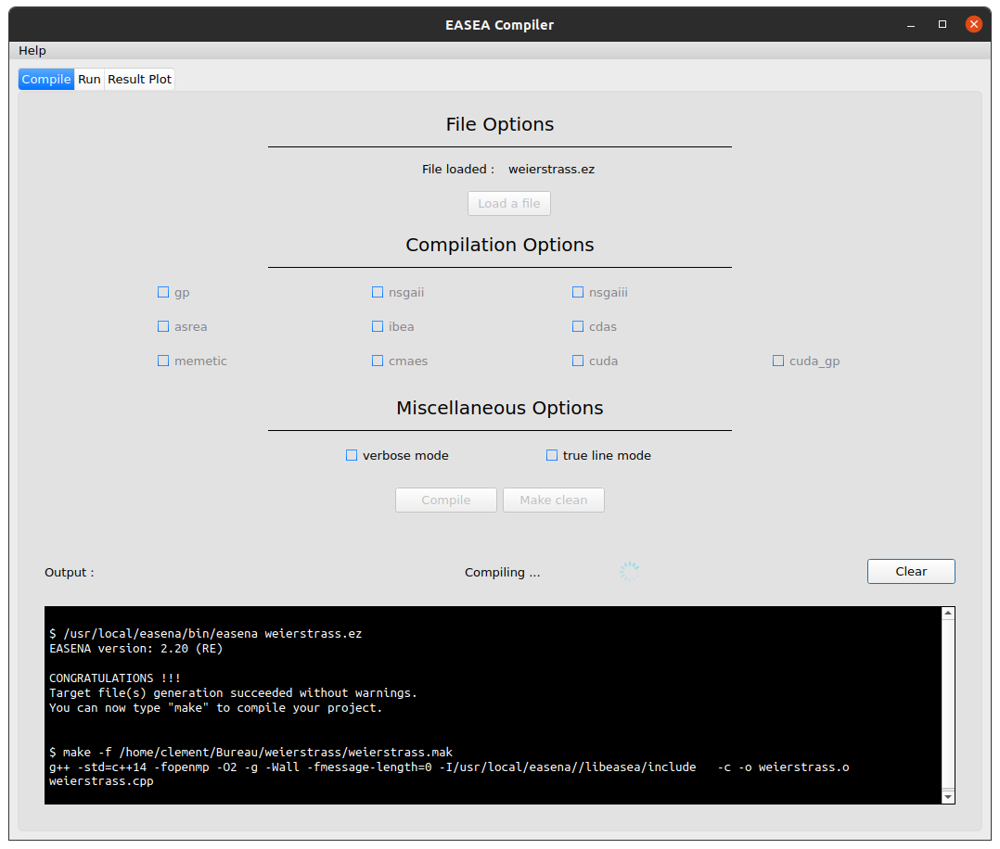
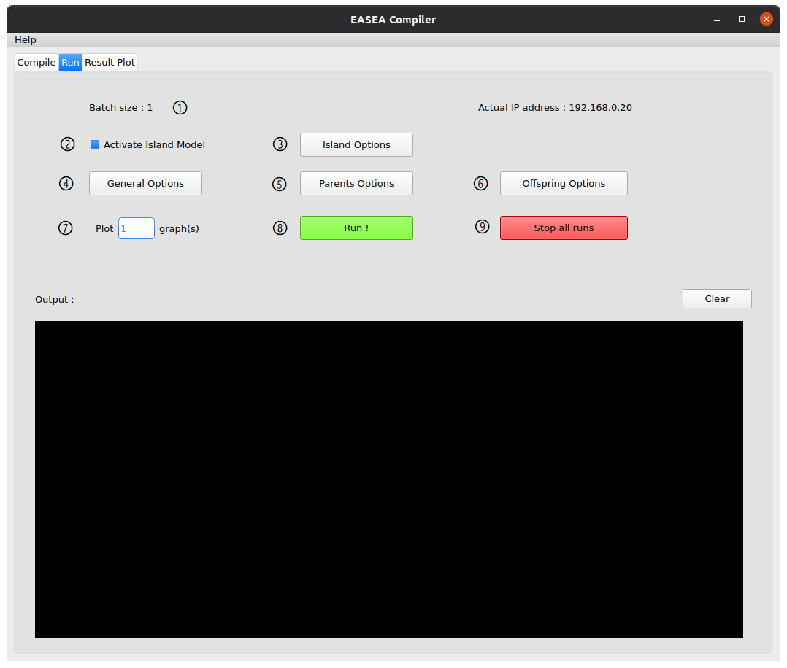
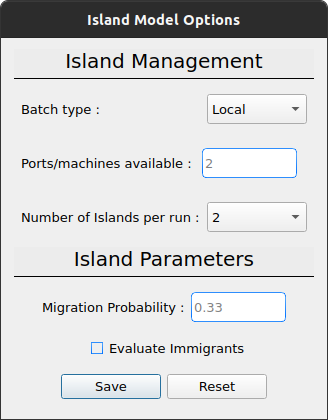
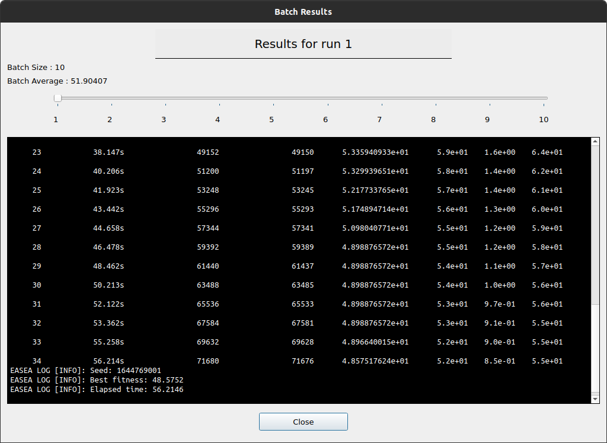
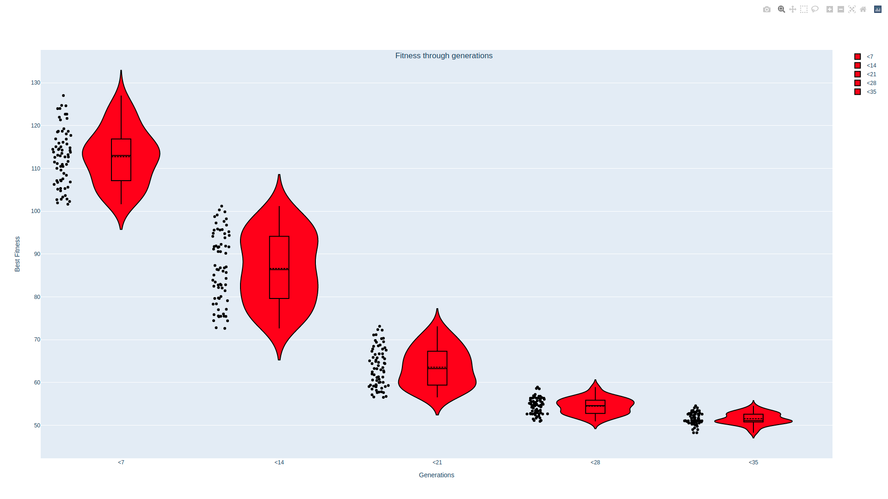
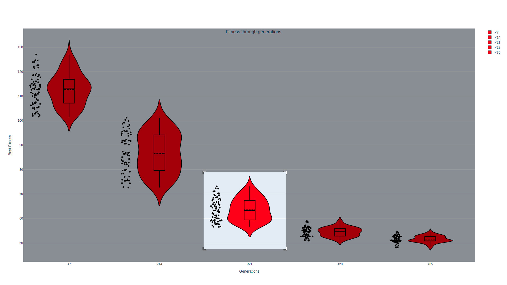
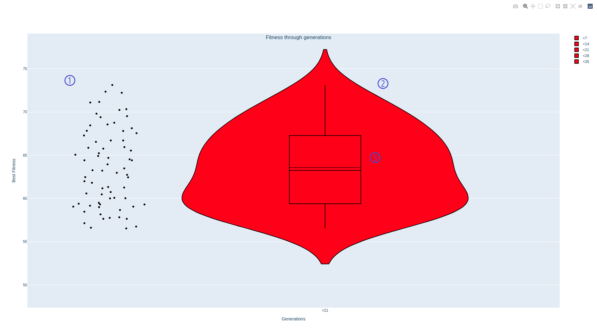

= GUIDE Documentation
Clément Ligneul <clement.ligneul@etu.unistra.fr>
v2.0.1 22/05/2022
:toc: left
:toc-title: Table des matières
:toclevels: 4
:hide-uri-scheme:

<<doc_en.adoc#, English Version>>

== A propos

Cette application implémente une interface graphique dans le but de simplifier la compilation et l'exécution de programmes utilisant la plateforme http://easea.unistra.fr/index.php/EASEA_platform[EASEA, window=_blank]. Elle offre aussi d'autres fonctionnalités utiles comme l'exécution en batch ou la représentation graphique de résultats.

== Dépendances

=== EASEA

Vous devez avoir installé EASEA avant d'utiliser cette application. Pour cela, cloner https://github.com/EASEA/easea[ce dépôt, window=_blank] et suivez les instructions du README.

=== Représentation graphique des résultats

Pour générer le graphe des résultats vous devez installer :

- Python (Python 3 recommandé)

- Plotly :
    * avec pip : `pip install plotly==5.1.0`
    * avec conda : `conda install -c plotly plotly=5.1.0` 

- Pandas :
    * avec pip : `pip install pandas`

- Kaleido pour exporter les graphes :
    * avec pip : `pip install kaleido`
    * avec conda : `conda install -c conda-forge python-kaleido`

- QT :
    * https://www.qt.io/qt5-11[QT5, window=_blank] est recommandé

Notez que plotly ne fonctionne qu'à partir de la version 10.10 de macOS (64 bit seulement).

== Installation

// Une fois les dépendances installées si vous utilisez le https://git.unistra.fr/ligneul/easea-compiler-app[dépôt de développement, window=_blank] :

//     - exécutez `sudo make install` dans le repertoire principal
//     - vous pouvez maintenant lancer l'application avec la commande `guide` depuis n'importe où.
//     - pour désinstaller l'application faites `make uninstall` depuis le répertoire principal

// Si vous installez l'interface depuis le  https://github.com/EASEA/easea[dépôt github d'EASEA, window=_blank] :

    - déplacez-vous dans le répertoire `GUIDE` avec `cd easea/GUIDE/`
    - exécutez `sudo make install`
    - vous pouvez maintenant lancer l'application avec la commande `guide` depuis n'importe où.
    - pour désinstaller l'application faites `make uninstall` depuis le répertoire `easea/GUIDE/`

// == Version développeur

// Lancer la commande `npm start` dans le répertoire principal permet d'ouvrir l'application sans devoir générer d'exécutable mais aussi d'afficher dans la console les informations pouvant servir au débogage. Démarrer l'application en lançant l'exécutable depuis une console permet aussi d'afficher ces informations.

== Tutoriels

=== Simple exécution

Dans ce tutoriel nous allons simplement compiler et exécuter le fichier `weierstrass.ez` se trouvant dans le répertoire `/examples` d'EASEA.

==== Compilation

. Dans l'onglet `Compile` chargez le fichier `easea/examples/weierstrass/weierstrass.ez`
. Nous n'utilisons aucune option pour cette compilation, cliquez donc directement sur `Compile`
. Après avoir lancé la compilation vous devez voir ceci :

==== Lancement du programme

Allez dans l'onglet `Run`.

Nous ne faisons qu'une simple exécution sans aucun paramètre, cliquez donc juste sur `Run!`.

Si vous voulez modifier certains paramètres avant le lancement, vous pouvez le faire via les différents boutons qui sont détaillés plus bas.

==== Affichage graphique des résultats

Si l'exécution se termine correctement vous pouvez voir le résultat dans la console et le graphe dans l'onglet `Result plot`. Vous trouverez plus d'informations à la section <<Onglet Result Plot>>.

=== Exécution en batch

// [red]#N'utilisez pas l'exécution en batch avec les options de compilation pour <<Problèmes multi-objectifs, problèmes multi-objectifs>> car seuls les resultats vont s'écraser entre eux#

Cette application permet de lancer plusieurs fois le même programme en même temps (batch). Dans ce tutoriel nous utiliserons le fichier `weierstrass.ez` du répertoire `/examples` d'EASEA.

1) Dans l'onglet `Compile`, chargez le fichier puis compilez-le sans ajouter d'options

2) Dans l'onglet `Run`, cliquez sur `General Options` et mettez 10 pour l'option "Batch size" puis sauvegardez

image::images/general_menu_batch.png[general menu batch image, 850, align=center]

3) En dessous du bouton `General options` il est possible de définir le nombre de diagrammes en violon (violin plot) que nous souhaitons dessiner. Mettez 5 et cliquez sur `Run!`

4) Lorsque toutes les exécutions sont terminées vous devez voir ceci :

image::images/end_run_batch.png[end run batch image, 800, align=center]

5) Dans l'onglet `Result Plot` vous pouvez voir le graphe généré comme nous l'avons demandé, c'est-à-dire avec les 5 diagrammes en violon. Vous pouvez trouver plus d'informations sur ce type de diagramme dans la section <<Onglet Result Plot>>

image::images/2d_results.png[2d results image, 800, align=center]

== Détails de l'interface

Lorsque vous ouvrez l'application vous arrivez sur le premier onglet qui vous permet de compiler votre programme.

Le deuxième onglet permet de choisir les options d'exécution puis de le lancer.

Le troisième est dédié à la représentation graphique des résultats selon les paramètres sélectionnés au préalable.

=== Onglet Compile

image::images/empty_compile.png[empty compilation image, 800, align=center]

① Permet de charger le fichier à exécuter

② Options de compilation. Les options `cuda` et `cuda_gp` n'apparaissent que si vous avez installé CUDA SDK et `nvcc` (https://developer.nvidia.com/cuda-downloads[ window=_blank])

③ D'autres options qui permettent d'obtenir une compilation plus détaillée

④ Lance la compilation

⑤ Lorsque vous avez compilé/exécuté votre projet, un Makefile ainsi que d'autres fichiers sont générés. Pour les supprimer et "nettoyer" le répertoire cliquez sur `Make clean` (notez que les fichiers `.log` ne seront pas effacés)

EASEA offre plusieurs options pour compiler votre projet. Pour plus de détails sur ces options consultez la documentation http://easea.unistra.fr/index.php/EASEA_command_line[ici, window=_blank].

=== Onglet Run

Vous devez compiler votre projet avant de le lancer.

① Taille du batch (voir <<Exécution en batch>>)

② Active le modèle en ilots

③ Options pour l'exécution en ilots. Ce bouton apparaît seulement après avoir activé cette fonction. Ce menu est détaillé dans la section <<Island model options>>.

④ Options générales. Vous trouverez ici toutes les options concernant l'exéctution générale. Ce menu est détaillé dans la section <<General options>>.

⑤ Option pour les parents. Vous trouverez ici toutes les options concernant le paramétrage des parents. Ce menu est détaillé dans la section <<Parents options>>.

⑥ Options pour les descendances. Vous trouverez ici toutes les options concernant le paramétrage des descendances. Ce menu est détaillé dans la section <<Offspring options>>.

⑦ Le nombre de graphes désiré. La valeur entrée donne le nombre de diagrammes en violon (violin plot) à tracer et répartie les générations entre ces graphes (par exemple si vous avez un total de 100 générations et que vous voulez tracer 10 graphes, vous allez obtenir 10 graphes de 10 générations). Ce paramètre n'est valable que si vous n'utilisez pas les options de compilation pour un <<Problèmes multi-objectifs, problème multi-objectifs>>.

⑧ Lance les exécutions.

⑨ Permet d'arrêter toutes les exécutions en cours.

Dans la fenêtre "output" apparaissent les commandes lancées ainsi que tout ce qui provient de la sortie du premier processus si vous faites une exécution en batch.

==== General options

image::images/general_menu.png[general menu image, 900, align=center]

- [underline]#Plot Stats# : Affiche le graphe associé au premier processus du batch

- [underline]#Generate CSV File# : Sauvegarde les résultats dans un fichier CSV

- [underline]#Print Initial Population# : Affiche la population initiale 

- [underline]#Print Final Population# : Affiche la population à la fin de l'exécution

- [underline]#Start From File# : Utilise un fichier `.pop` comme population de départ

- [underline]#Generate R Script# : Génère un script R pour afficher les stats

- [underline]#Generate Plot Script# : Génère un script Gnuplot pour afficher les stats

- [underline]#Save Population# : Sauvegarde la population à la fin de l'exécution

- [underline]#Population Size# : Fixe la taille de la population

- [underline]#Nb Generations# : Fixe le nombre de générations

- [underline]#Time Limit# : Fixe la limite de temps pour chaque exécution. Aucune limite de temps si ce paramètre vaut 0

- [underline]#Elite Type# : Fixe le type d'élitisme. Choix entre Strong (fort) et Weak (faible)

- [underline]#Elite Size# : Fixe le nombre d'individus élites

- [underline]#Selection Operator# : Fixe l'opérateur de sélection (Tournoi par défaut). Il est possible de choisir parmi les opérateurs Tournament, Deterministic, Roulette et random. Notez que l'opérateur Roulette ne peut être utilisé qu'avec le paramètre "Evaluator Goal" ayant pour valeur "maximize"

- [underline]#Selection Pressure# : Fixe la pression de sélection. Ce champ n'est disponible que si vous utilisez "Tournament" (tournoi) comme opérateur de sélection. Cette valeur doit être comprise entre 0,5 et 0,9999... inclus ou supérieure à 2 (vaut 2 par défaut)

- [underline]#Reduce Final Operator# : Fixe l'opérateur de réduction final (Tournoi par défaut)

- [underline]#Reduce Final Pressure# : Fixe la pression de la réduction finale. Ce champ n'est disponible que si vous utilisez "Tournament" (tournoi) comme opérateur de réduction final. Cette valeur doit être comprise entre 0,5 et 0,9999... inclus ou supérieure à 2 (vaut 2 par défaut)

- [underline]#Baldwinism# : Conserve la fitness (0 par défaut)

- [underline]#Number of the first GPU used for computation# : Numéro du premier GPU utilisé

- [underline]#Number of the first GPU NOT used for computation# : Numéro du premier GPU NON utilisé

- [underline]#Initial Population# : Fichier contenant la population à utiliser

- [underline]#Output File# : Nom du fichier servant à sauvegarder la population finale

- [underline]#Optimize Iterations# : Nombre d'itérations d'optimisation (100 par défaut)

- [underline]#Compression# : Fixe le niveau de compression

- [underline]#Batch Size# : Nombre d'exécutions à effectuer. La taille du batch est actuellement limitée à 500 mais une taille de 30 maximum est recommandée. [red]#Attention : lancer un très grand nombre d'exécutions peut causer des dysfonctionnements selon les capacités de la machine#
//[red]#N'utilisez pas l'exécution en batch avec les options de compilation pour un <<Problèmes multi-objectifs, problème multi-objectifs>>#

- [underline]#Nb Of Threads# : Nombre de threads à utiliser pour chaque exécution (20 par défaut)

- [underline]#User parameters# : Paramètres à passer au programme (jusqu'à 5)

===== Utilisation des graines (seeds)

- [underline]#First seed# : Valeur de la première graine. Si ce champ est laissé vide la première graine est égale au temps actuel en secondes.

- [underline]#Seeds by run# : Ce tableau permet de choisir la graine pour chaque exécution. Vous devez spécifier la taille du batch avant. Si une case est laissée vide, l'exécution associée sera lancée avec une graine égale à la première incrémentée du nombre de case vide avant celle-ci. 
Par exemple, la première graine vaut 0 et nous avons un batch de taille 3. Si la graine du deuxième processus vaut 42 et que les autres cases sont vides alors la graine du processus 1 vaut 0, celle du processus 2 vaut 42, et celle du processus 3 vaut 1.

La plupart des options par défaut sont obtenues à partir du contenu du fichier `.ez`

==== Parents options

image::images/parents_menu.png[parents menu image, 300, align=center]

- [underline]#Surviving Parents# : Fixe la valeur de réduction de la population des parents. Il est possible d'exprimer une valeur absolue (`#`) ou un pourcentage (`%`)

- [underline]#Reduction Operator# : Fixe l'opérateur de réduction (Tournoi par défaut). Il est possible de choisir parmi les opérateurs Tournament, Deterministic, Roulette et random. Notez que l'opérateur Roulette ne peut être utilisé qu'avec le paramètre "Evaluator Goal" ayant pour valeur "maximize"

- [underline]#Reduce Pressure# : Fixe la pression de réduction. Ce champ n'est disponible que si vous utilisez "Tournament" (tournoi) comme opérateur de sélection. Cette valeur doit être comprise entre 0,5 et 0,9999... inclus ou supérieure à 2 (vaut 2 par défaut)

==== Offspring options

image::images/off_menu.png[offspring menu image, 300, align=center]

- [underline]#Offspring Size# : Fixe le nombre de descendances

- [underline]#Surviving Offspring# : Fixe la valeur de réduction de la descendance. Il est possible d'exprimer une valeur absolue (`#`) ou un pourcentage (`%`)

- [underline]#Reduction Operator# : Fixe l'opérateur de réduction (Tournoi par défaut). Il est possible de choisir parmi les opérateurs Tournament, Deterministic, Roulette et random. Notez que l'opérateur Roulette ne peut être utilisé qu'avec le paramètre "Evaluator Goal" ayant pour valeur "maximize"

- [underline]#Reduce Pressure# : Fixe la pression de réduction. Ce champ n'est disponible que si vous utilisez "Tournament" (tournoi) comme opérateur de sélection. Cette valeur doit être comprise entre 0,5 et 0,9999... inclus ou supérieure à 2 (vaut 2 par défaut)

==== Island model options

Ce menu n'est disponible que si l'exécution en ilots est activée

- [underline]#Batch Type# : Type de modèle en ilôt (local ou à distance)

- [underline]#Ports/machines available# : Nombre de ports, pour les exécutions locales, ou nombre de machines, pour les exécutions à distance, utilisables

- [underline]#Number of islands per run# : Nombre d'ilôts dans chaque runs

- [underline]#IP file# : Fichier contenant toutes les adresses IP des ilots. Les fichiers IP sont générés automatiquement en mode local

- [underline]#Migration Probability# : Probabilité d'envoyer un individu à chaque génération

- [underline]#Evaluate Immigrants# : Réévaluer les individus migrants

Notez que l'exécution en ilôts ne produit pas de graphe de résultats.

==== See Results

Quand toutes les exécutions d'un batch sont terminées, un nouveau boutton apparaît. Il permet de consulter le resultat pour chacunes d'entre elles. Cette fonction n'est pas disponible pour des exécution sur des <<Problèmes multi-objectifs, problèmes multi-objectifs>>.

image::images/end_run_batch.png[end run in batch image, 800, align=center]

Pour voir les différents résultats, utilisez le curseur :

image::images/results_6.png[results 6 image, 800, align=center]

=== Onglet Result Plot

A la fin de toutes les exécutions, si aucune erreur n'est survenue, cette application va générer un graphe en fonction des paramètres de compilation utilisés.
Par défaut, seule la dernière génération d'un run est tracée. Pour afficher le diagramme en violon de l'ensemble des générations, désélectionnez "Plot the last generation only"
dans le menu update plot.

Utiliser une option de compilation pour un <<Problèmes multi-objectifs, problème multi-objectifs>> va générer un graphe 3D, dans les autres cas, vous obtiendrez un graphe contenant un ou plusieurs diagrammes en violon.

==== Diagramme en violon

Dans l'onglet Run, avant de lancer l'exécution, vous pouvez choisir le nombre de diagramme en violon que vous souhaitez tracer. Le nombre de points dans chaque graphe dépend du nombre de générations et de la taille du batch.

[underline]#Exemple# : 

L'exemple suivant utilise le fichier `easea/examples/weierstrass.ez`.

Dans ce fichier nous avons un total de 35 générations. Nous choisissons de lancer un batch de taille 10 et de tracer 5 violin plots. Après exécution nous obtenons 5 diagrammes en violon contenant 7 générations chacun (35 générations / 5 graphes). Nous avons lancé un batch de 10 donc dans chaque violin plot nous obtenons 7x10 = 70 points. Chaque point représentant la meilleure valeur de la génération calculée.

Ainsi le premier graphe contient les générations 0 à 6, le second celles de 7 à 13 etc...

image::images/2d_results.png[2d results image, 800, align=center]

La qualité de l'image est réduite pour l'afficher dans l'application c'est pourquoi il est recommandé d'utiliser la version interactive pour voir les détails.

==== Version interactive du diagramme en violon

Pour accéder à la version interactive du graphe généré *double-cliquez* sur le graphe.

Pour zoomer sur la figure, encadrez la zone. Pour retourner à la vue globale, double-cliquez n'importe où.

Dans chaque graphe on retrouve 3 éléments :

    - ① Les données brutes

    - ② Le diagramme en violon

    - ③ La boîte à moustache

Exemple de graphe 2D interactif link:./images/interactive_2d.html[ici, window=_blank].

==== Graphique 3D

Ce graphique remplace celui avec les diagrammes en violon si vous avez compilé avec une option pour un <<Problèmes multi-objectifs, problème multi-objectifs>>.

image::images/3D_update.png[3d results image, 800, align=center]

==== Version interactive du graphique 3D

Pour ouvrir la version interactive *double-cliquez* sur le graphe.

image::images/interactive_3d.png[3d interactive results image, 1000, align=center]

Déplacer la souris avec le clic gauche permet de faire tourner la figure.

Déplacer la souris avec le clic droit permet de déplacer la figure sur les axes x y.

Vous pouvez retourner à la vue de départ grâce à la barre d'outils en haut à droite.

Exemple de graphe 3D interactif link:./images/interactive_3d.html[ici, window=_blank].

==== Sauvegarder le graphe des résultats

Pour sauvegarder les graphes cliquez sur le bouton approprié :

- `Save static plot` permet de sauvegarder la figure telle qu'elle appraît dans l'application

- `Save interactive plot` permet de sauvegarder le fichier html que vous ouvrez pour accéder à la version interactive

Il est recommandé de sauvegarder vos graphes depuis le mode interactif en cliquant sur l'icône appareil photo. De cette manière vous pourrez sauvegarder la vue que vous souhaitez et avec une meilleure qualité.

==== Editer le graphe des résultats

image:images/update_menu.png[ update plot menu image, 300, align=center]
image:images/update_menu_3d.png[ update plot menu image, 300, align=center]

Une fois généré, le graphe des résultats est modifiable. Il est possible de changer :

- Le titre
- Le nom des axes
- Le nombre de diagrammes en violon s'il s'agit d'un graphe 2D
- La couleur s'il s'agit d'un graphe 2D

== Problèmes multi-objectifs

Pour les problèmes multi-objectifs les options de compilation sont :

    - `nsgaii`
    - `nsgaiii`
    - `asrea`
    - `ibea`
    - `cdas`

//Si vous utilisez l'une de ces options ne faites pas d'exécution en batch car les résultats vont s'écraser entre eux.

== Conseils

- Si vous exécutez un programme qui prend plus d'une minute à se terminer, mettez le paramètre "Time limit" à 0 afin d'avoir une exécution complète

- Vous pouvez consultez le site d'EASEA depuis le menu "help". Sur le site vous pourrez trouver des informations utiles comme la description des options de compilation

- Les raccourcis courants fonctionnent dans l'application (ctrl+tab pour changer d'onglet, tab et shift+tab pour changer le focus etc...) 

- Si vous lancez l'exécutable de l'application depuis un terminal vous pouvez voir des informations utiles en cas de problèmes

== Licence

Cette application est placée sous licence "GNU AFFERO GENERAL PUBLIC LICENSE Version 3"
