= EASEA Compiler App Documentation
Clément Ligneul <clement.ligneul@etu.unistra.fr>
v2.0 14/02/2022
:toc: left
:toclevels: 4
:hide-uri-scheme:

<<doc_fr.adoc#, Version Française>>

== About

=== About EASEA

EASEA (EAsy Specification of Evolutionary Algorithms) is an Artificial Evolution platform that allows scientists with only basic skills in computer science to implement evolutionary algorithms and to exploit the massive parallelism of many-core architectures in order to optimize virtually any real-world problems (continous, discrete, combinatorial, mixed and more (with Genetic Programming)), typically allowing for speedups up to x500 on a $3,000 machine, depending on the complexity of the evaluation function of the inverse problem to be solved.

More informations http://easea.unistra.fr/index.php/EASEA_platform[here, window=_blank].

=== About this application

This application simplifies the compilation and execution process by implementing a user interface. This way it is possible to compile and run `.ez` programs with just a few clicks.

== Dependencies

=== EASEA

You must install EASEA to use this application. To do this, clone the https://github.com/EASEA/easea[following repository, window=_blank] and follow the README.

=== Plot results

To plot your results, you need to install :

- Python (Python 3 recommended)

- Plotly :
    * with pip : `pip install plotly==5.1.0`
    * with conda : `conda install -c plotly plotly=5.1.0` 

- Pandas :
    * with pip : `pip install pandas`

- Kaleido to export graphics :
    * with pip : `pip install kaleido`
    * with conda : `conda install -c conda-forge python-kaleido`

- Qt :
    * https://www.qt.io/qt5-11[QT5, window=_blank] or later is recommended

Note that if you are using macOS, plotly only works on version 10.10 or more (OS 64 bits).

== Installation

Once the dependencies are installed, if you are using the https://git.unistra.fr/ligneul/easea-compiler-app[development repository, window=_blank]:

    - run `make install` in the main directory
    - now you can run the executable in `EASEA-compiler-app/` named `easea-compiler-app`. If the executable is installed, you can also run `easea-compiler-app` from anywhere
    - run `make uninstall` in the main directory to uninstall the application

If you are installing the interface from the https://github.com/EASEA/easea[EASEA github repository, window=_blank]:

    - move to the `easea-ui/` directory with `cd easea/easea-ui/`
    - run `sudo make install`
    - you can now launch the application with the `easea-compiler-app` command from anywhere.
    - to uninstall the application run `make uninstall` from the directory `easea/easea-interface/`

// == Dev version

// Running `npm start` in the main directory will allow you to see all the debugging information in the terminal. This is useful if you have any problems. This command recompiles everything each time you use it. You can also see debugging information from the executable if you run it into a terminal.

== Quick tutorials

=== Simple run

In this tutorial we will compile and run the file `weierstrass.ez` from the `/examples` directory of EASEA in the easiest way.

==== Compilation

. In the compile tab load `easea/examples/weierstrass/weierstrass.ez`
. We don't use any options in this compilation so just click on the `Compile` button
. After clicking on this button you see this :

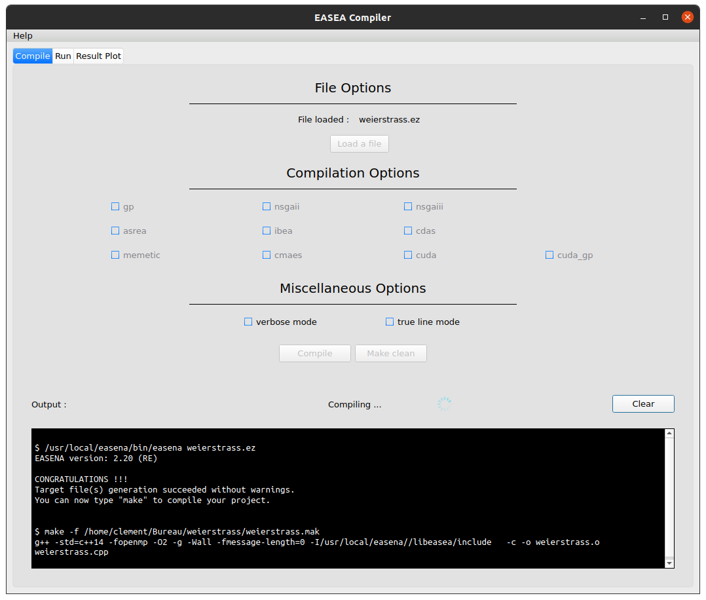

==== Run

Go to `Run` tab.

We just want a simple execution of our program so we just have to click `Run!`.

If you want to add more options to the execution, take a look at the different menus depending on your needs.

The description of these menus is given below.

==== Plot results

If the run finished correctly you can now see the plot in the Result Plot tab (see more in the <<Result Plot tab>> section)

=== Run in batch

// [red]#Don't use the run in batch if you have compiled with options for <<Multi-objective problems, Multi-objective problems>>.#

This application allows to run the same program several times at the same time (batch). In this tutorial we will use the file `weierstrass.ez` from the `/examples` directory of EASEA.

1) Load and compile the file in the `Compile` tab without any options

2) In the `Run` tab click on `General Options` and set "Batch size" to 10, then save

image::images/general_menu_batch.png[general menu batch image, 850, align=center]

3) Under the `General options` button we can choose the number of violin plots. Set it to 5 and click `Run!`

4) At the end of these runs you should see something like this :

image::images/end_run_batch.png[end run batch image, 800, align=center]

5) In the `Result Plot` tab you can see the graph generated as we requested : 5 violin plots (for more informations about this graph see <<Result Plot tab>>)

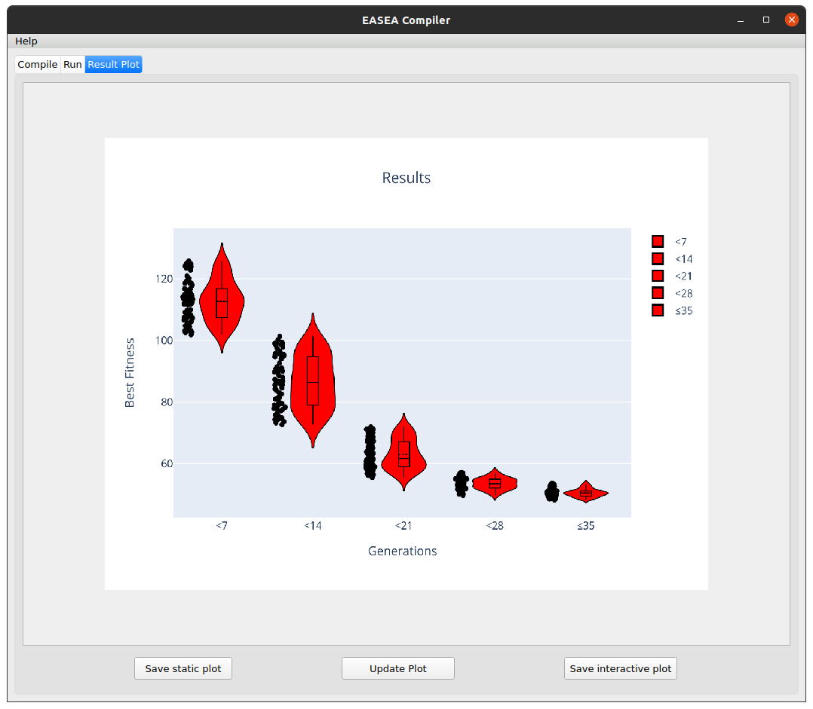

== Interface detailed

When you open the app, you go to the first tab which allows you to compile.

The second lets you select your options and run.

The last one is dedicated to plotting the results according to the compilation and execution options.

=== Compile tab

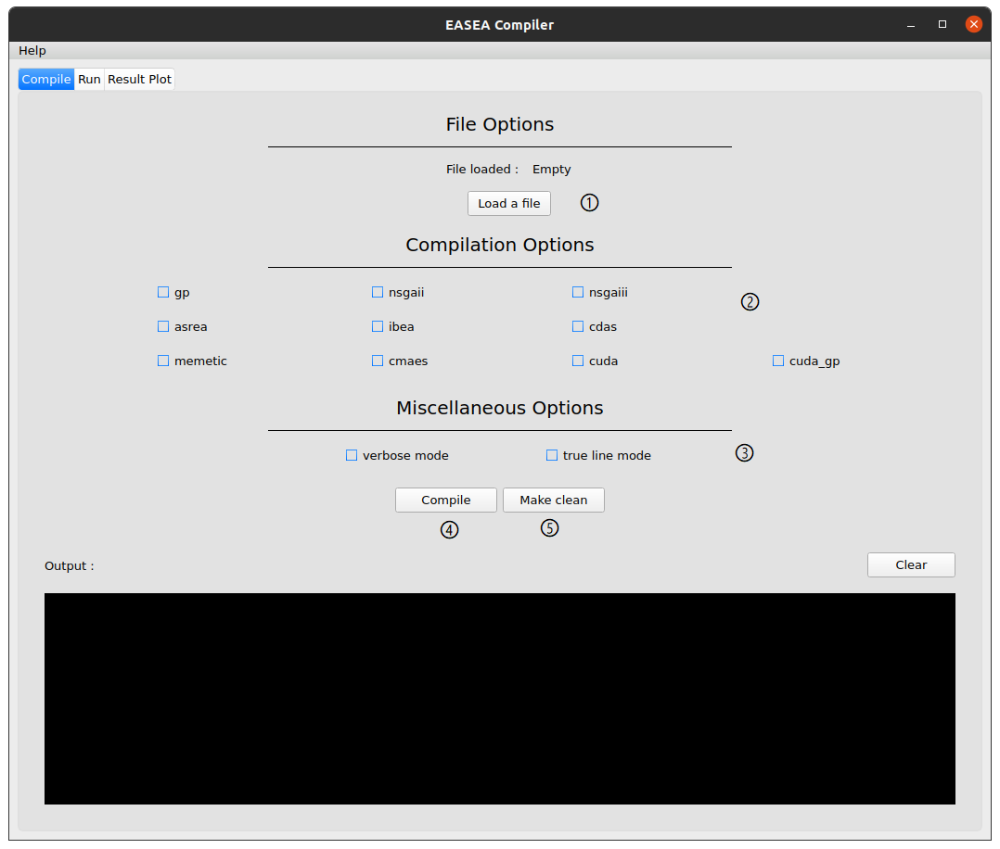

① Load your file

② Choose your compilation options. The `cuda` and `cuda_gp` options appear only if you have installed CUDA SDK and `nvcc` (https://developer.nvidia.com/cuda-downloads[ window=_blank])

③ You can add more options to get a detailed compilation

④ Run the compilation

⑤ Once you have compiled/runned your project, a Makefile with other files will be generated. To remove these files click on `Make clean` button (note that the `.log` files will not be deleted).

EASEA offers many options for compiling your `.ez` projects. If you want to see them in detail, check out http://easea.unistra.fr/index.php/EASEA_command_line[easea commands, window=_blank]

=== Run tab

You must compile your project before running it.

image::images/islands_activated.png[island activation image, 800, align=center]

① Size of the batch (see <<Run in batch>>)

② Activate the island model

③ Options for running the island model. This button appear only when you activate the island model. This menu is more detailed <<Island model options, here>>.

④ General options. Here you will find all the options regarding the global execution. This menu is more detailed <<General options, here>>.

⑤ Parents options. Here you will find all the options regarding the parents settings. This menu is more detailed <<Parents options, here>>.

⑥ Offsping options. Here you will find all the options regarding the offspring settings. This menu is more detailed <<Offspring options, here>>.

⑦ The number of plots desired. The number entered gives the number of violin plots to be traced and distribute generations in these graphs (e.g if you have a total of 100 generations and you want 10 plots you will have 10 graphs of 10 generations). This option is only available if you are not running a program with options for <<Multi-objective problems>>.

⑧ Start the runs

⑨ Stop all runs in progress

In the output window are written the commands executed and the output of the first run if you are running in batch.

==== General options

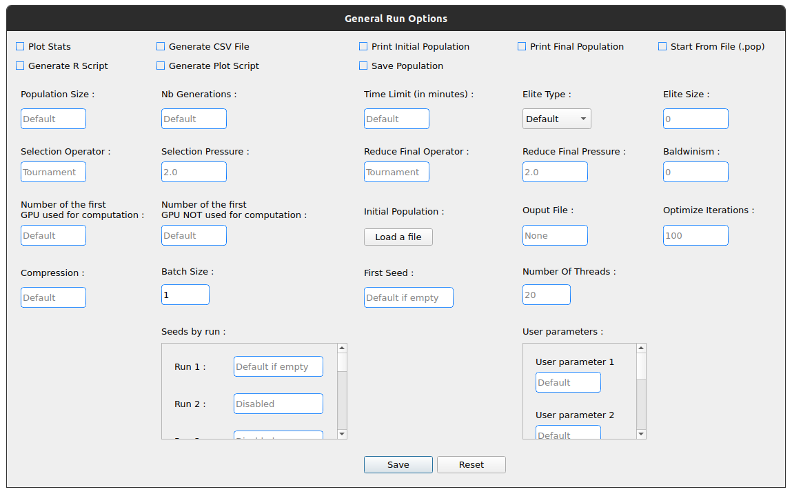

- [underline]#Plot Stats# : Plot the graph associated with the first run

- [underline]#Generate CSV File# : Save results to a CSV file

- [underline]#Print Initial Population# : Print the initial population used

- [underline]#Print Final Population# : Print the population at the end of the run

- [underline]#Start From File# : Use a `.pop` file as a starting population

- [underline]#Generate R Script# : Generate a R script to plot the Stats

- [underline]#Generate Plot Script# : Generate a Gnuplot script to plot the Stats

- [underline]#Save Population# : Save the population at the end

- [underline]#Population Size# : Set the population size 

- [underline]#Nb Generations# : Set the number of generations

- [underline]#Time Limit# : Set the time limit for each run. For no time limit, set it to 0.

- [underline]#Elite Type# : Set the elite type. You can choose between Strong and Weak

- [underline]#Elite Size# : Set the elite size

- [underline]#Selection Operator# : Set the selection operator (Tournament by default)

- [underline]#Selection Pressure# : Set the selection pressure. This field is available only if you are using Tournament as selection operator. This value must be between 0.5 and 0.9999... inclusive or greater than 2 inclusive (default 2)

- [underline]#Reduce Final Operator# : Set the final reducing operator (Tournament by default)

- [underline]#Reduce Final Pressure# : Set the final reducing pressure. This field is available only if you are using Tournament as final reduction operator. This value must be between 0.5 and 0.9999... inclusive or greater than 2 inclusive (default 2)

- [underline]#Baldwinism# : Only keep fitness (default 0)

- [underline]#Number of the first GPU used for computation# : ...

- [underline]#Number of the first GPU NOT used for computation# : ...

- [underline]#Initial Population# : File containing the population to use

- [underline]#Output File# : Set an output file for the final population

- [underline]#Optimize Iterations# : Set the number of optimisation iterations (default 100)

- [underline]#Compression# : Set the compression level

- [underline]#Batch Size# : Number of runs at the same time. Batch size is currently limited to 500 but it is recommended to limit to 30. [red]#Caution: run a very large number of executions may cause malfunctions depending on the capabilities of the machine#
// [red]#Don't use this option if you have compiled with options for <<Multi-objective problems>>#

- [underline]#Nb Of Threads# : Number of threads to use

- [underline]#User parameters# : Parameters to use for the program (up to 5)

===== Seeds

- [underline]#First seed# : Value of the first seed. If this field is empty the current timestamp in secondes is the first seed

- [underline]#Seeds by run# : This table allows to choose a seed for each run. You have to specify the batch size before. If a cell is empty, its run will have for seed the first incremented by the number of empty cells before (e.g first seed = 0 and we have 3 runs. If the seed for the run 2 is 42 and empty cell for the others, the seed for run 1 = 0 and the seed for run 3 = 1)

By default, most of the options are taken from the `.ez` file.

Note that if you run in batch only information about the first run will be displayed

==== Parents options

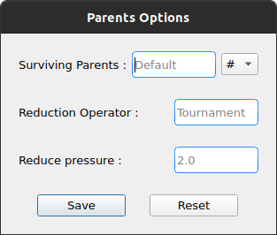

- [underline]#Surviving Parents# : Set the reduction size for parent population. It is possible to set an absolute value (`#`) or a percentage (`%`)

- [underline]#Reduction Operator# : Set the reduction operator (Tournament by default)

- [underline]#Reduce Pressure# : Set the reduction pressure. This field is available only if you are using Tournament as reduction operator. This value must be between 0.5 and 0.9999... inclusive or greater than 2 inclusive (default 2)

==== Offspring options

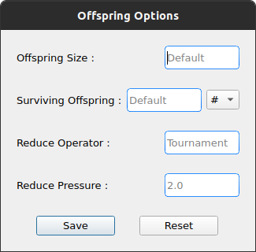

- [underline]#Offspring Size# : Set the offspring population size

- [underline]#Surviving Offspring# : Set the reduction size for offspring population. It is possible to set an absolute value (`#`) or a percentage (`%`)

- [underline]#Reduction Operator# : Set the reduction operator (Tournament by default)

- [underline]#Reduce Pressure# : Set the reduction pressure. This field is available only if you are using Tournament as reduction operator. This value must be between 0.5 and 0.9999... inclusive or greater than 2 inclusive (default 2)

==== Island model options

This menu is available after activating the remote island model

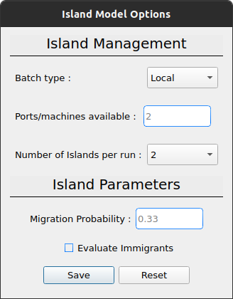

- [underline]#Batch Type# : Type of island model (local or remote)

- [underline]#Ports/machines available# : Number of ports for local executions and machines for remote executions usable

- [underline]#Number of islands per run# : Number of islands per run

- [underline]#IP file# : File containing all the IPs of the remote islands. IP files are automatically generated in local mode

- [underline]#Migration Probability# : Probability to send an individual each generation

- [underline]#Evaluate Immigrants# : Evaluate Immigrants

Note that the island model execution does not produce a result plot.

==== See Results

When all the runs are finished, a new button appears. It allows you to see the results of the different runs. This function is available only for non <<Multi-objective problems, multi-objective problems>>.

image::images/end_run_batch.png[end run in batch image, 800, align=center]

image::images/results_1.png[results 1 image, 800, align=center]

To see another run result, use the slider :

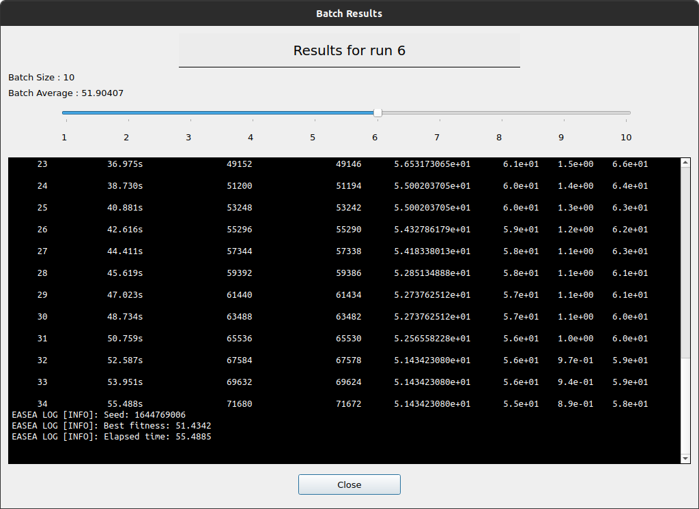

=== Result Plot tab

After all the runs, if there is no problem during the execution, the application will generate a graph according to your compilation options.

If you used options for <<Multi-objective problems>> you will have a 3D plot, otherwise, you will have a series of violin plots.

==== Violin plots

In the Run tab, before you launch the execution, you can choose the number of violin plots to trace. The number of points in each graph depend of the number of generations and the batch size.

[underline]#Example# : 

The following example uses `easea/examples/weierstrass.ez`.

In this file we have 35 generations. We choose to run a batch of 10 and print 5 plots. After the execution we have 5 violin plots with 7 generations each (35 generations / 5 plots). But we had runned a batch of 10 so in each violin plot we have 7x10 = 70 points. Each point representing the best fitness for the calculated generation.

The first graph takes the 7 first generations, the second takes the next 7 etc...

The image quality is reduced to put it in the application, we recommend using the interactive version of the graph to see the details.

==== Violin plots interactive version

To access the interactive version of the generated plot *double-click* on the graph. This version allows to handle it in a browser.

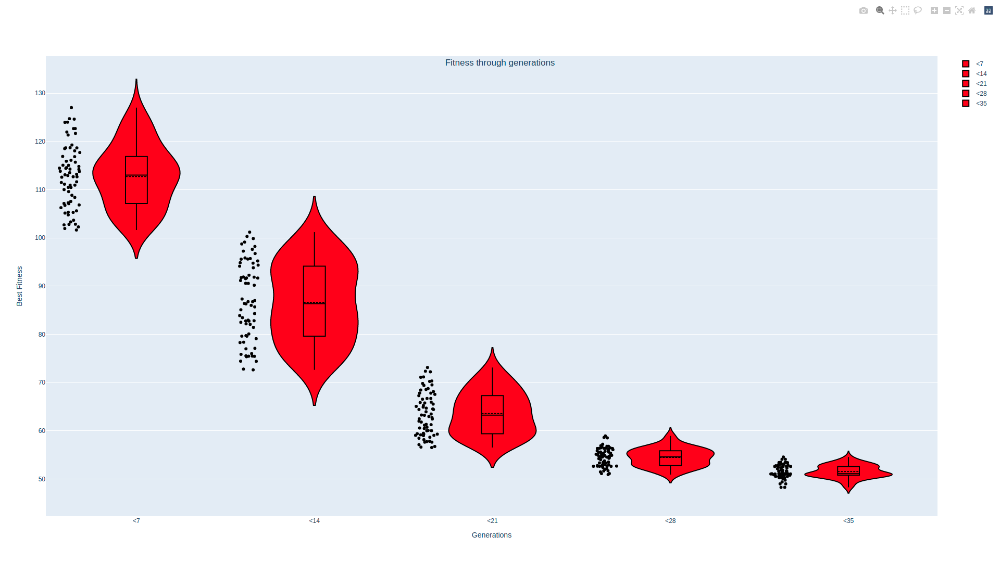

To zoom on a figure, frame it. To return to the default view double-click anywhere.

image::images/rect.png[rect zoom 2d interactive image, 1000, align=center]

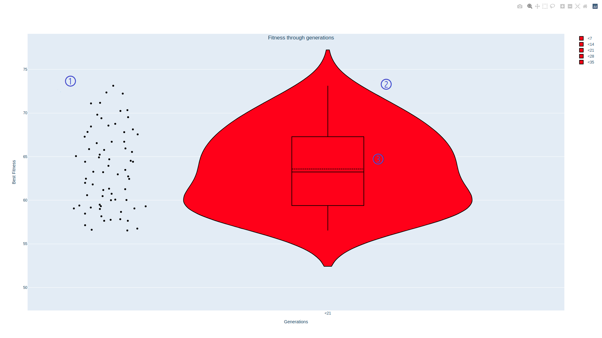

In each graph there are 3 elements :

    - ① The raw data

    - ② The violin plot

    - ③ The box plot

link:./images/interactive_2d.html[Here, window=_blank] is an example of a 2D graph.

==== 3D plot

This plot replaces the graph with the violin plots if you have compiled and run a program with the options for <<Multi-objective problems>>.

image::images/3D_update.png[3d results image, 800, align=center]

==== 3D plot interactive version

To open the interactive version *double-click* on the graph.

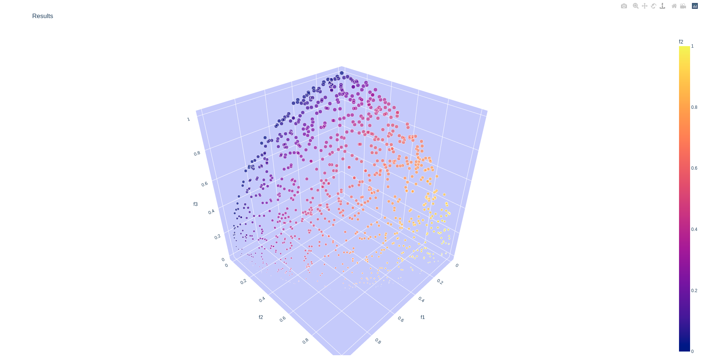

Holding the left click rotates the figure.

Right click moves the graph on the x y axis.

You can reset the view with the toolbar at the top right.

link:./images/interactive_3d.html[Here, window=_blank] is an example of a 3D graph.

==== Save the results graph

To save the results you can click on the appropriate button :

- `Save static plot` will save the plot as you can see it in the application. 

- `Save interactive plot` will save the html file that you open when you double-click the image in the app.

We recommend to save your plots from the interactive version with camera icon. This way you can save the view you want with a better quality.

==== Edit the results graph

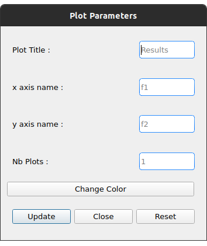
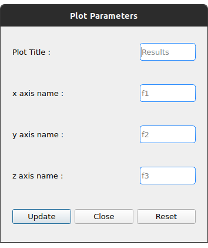

Once you have generated the result plot you can edit it. It is possible to change :

- The plot title
- The axis names
- The number of violin plots if the plot is a 2D plot
- The plot color if it is a 2D graph

== Multi-objective problems

Compilation options for multi-objective problems are :

    - `nsgaii`
    - `nsgaiii`
    - `asrea`
    - `ibea`
    - `cdas`

//If you use one of these options do not run in batch because the results will be overwritten with each other.

== Tips

- If the run takes a long time, set "Time limit" option to 0 to have complete execution
- You can go to the EASEA website with the help menu. You can find a lot of useful information in this site like description of the compilation parameters
- The usual shortcuts are available here like ctrl+tab to switch of tab, tab and shift+tab to change focus etc...
- If you launch the executable from a terminal you can see more debug information

== License

This application is under the "Creative Commons
Attribution - Non Commercial 4.0 International" license

To get a copy of this license, please consult:
    https://creativecommons.org/licenses/by-nc/4.0/[window=_blank]